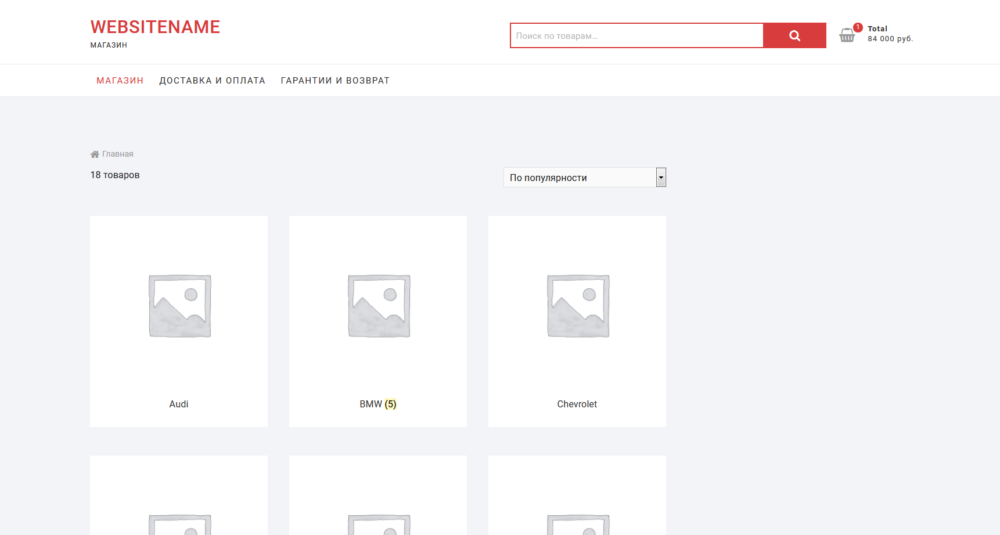
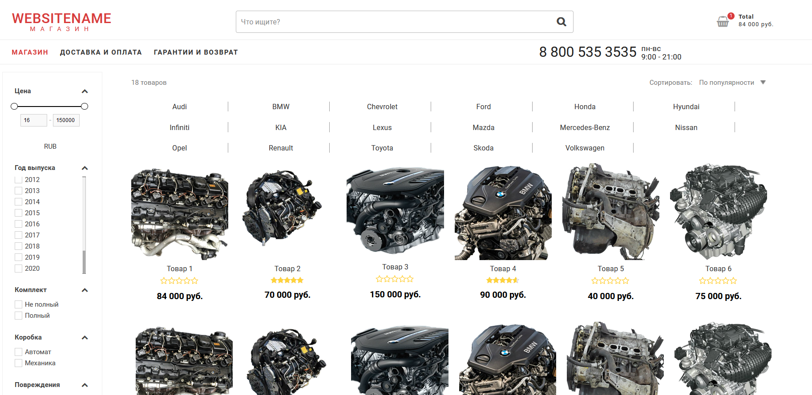

# Модификатор Wordpress темы Shoppingcart

## Оглавление

* [Описание](#desc)
* [Структура](#str)
* [Как работает](#str)
* [Установка](#inst)

<a name="desc">

# Описание

</a>

Скрипт изменяет расположение элементов на страницах шаблона после постройки DOM-дерева.  

**Было:(без кастомных css)**



**Стало:**



Ничто не мешает скрипту работать на любом другом wordpress-шаблоне.

<a name="str">

## Структура

</a>

* Changer.js - изменяет расположение элементов на всех страницах
* Product.js - модифицирует страницу продукта
* changes.js - передает данные для Changer.js
* product-changes.js - содержит данные для Product.js

<a name="how">

## Как работает

</a>

### Добавить элемент

В зависимости от того, на странице продукта нужен новый элемент или в другом месте, необходимо добавить javascript-объект в product-changes.js или changes.js соответственно.

```javascript
    {
        'container': '.new',
        'containerPosition': 0,
        'element': '',
        'before': '',
        'beforePosition': 0,
        'create': 'button',
        'id': 'new__id',
        'class': '',
        'attribute': ['type'],
        'attributeValue': ['submit'],
        'clone': false,
        'insertHTML': '<div></div>',
        'ul': '.ul',
        'categoryLi': '.product',
        'checkUL': '.product-list'
	}
```
container - Элемент внутри которого будет создан новый элемент.  
containerPosition - если контейнеров несколько, тогда здесь указываем его номер в коллекции, иначе 0. Можно временно поставить:

```javascript
    console.log(document.querySelectorAll(el.container))
```
в начале метода placeChanger(el) и посмотреть в консоле номер необходимого элемента в коллекции.

#### Значения

* element - взять элемент.  
* before - перенести element и вставить перед before.  
* beforePosition - позиция before-элемента в коллекции если их несколько, иначе 0.  
* create - создать элемент.  
* checkUL - если create: 'ul', тогда проверяет есть ли такой ul  
* id - присвоить элементу id.  
* class - присвоить элементу класс.  
* attribute - присвоить элементу атрибут.  
* attributeValue - добавить атрибуту attribute значение.  
* clone - если необходимо сделать копию элемента  
* insertHTML - вставить HTML-код в container  
* check - объект со свойством check обрабатывается если данные классы есть на странице  
* checkLimit - объект обрабатывается если класс/классы есть в указанных экземплярах  
* event - добавляет событие  
* event.type - тип события  
* event.container - для кого событие  
* event.eventFor - элемент на котором происходит результат события  
* event.toggleClass - переключатель класса  

**данные необходимые только для этого шаблона**

* ul - ищет ul  
* location - в зависимости от адреса страницы  
* filtredClass - добавляет класс или нет  
* catagoryLi - разделяет выбранные li на несколько ul  
* contains - проверяет содержит ли список какой-либо класс, в зависимости от этого добавляется filtredClass или class  
* exist - добавляет класс, если на странице нет элементов из exist  

### Примеры

#### Создать еще один элемент

Создает div с классами one и two внутри которого span и помещает все это в элемент с классом .mywebsite.

```javascript
        {
			'container': '.mywebsite',
			'containerPosition': 0,
			'create': 'div',
			'class': ['one', 'two'],
			'insertHTML': '<span></span>'
        }
```
#### Копировать элемент

Возьми element с классом .search, сделай копию и вставь ее в container с классом .mywebsite последним ребенком.

```javascript
        {
			'container': '.mywebsite',
			'containerPosition': 0,
			'element': '.search',
			'clone': true
        },
```
#### Перенести элемент

Возьми element с классом .search и вставь его в container с классом .mywebsite перед before с классом .header (если нужно, иначе вставь последним ребенком)

```javascript
        {
			'container': '.mywebsite',
			'containerPosition': 0,
			'element': '.search',
			'before': '.header',
			'beforePosition': 0
        }
```
<a name="inst">

## Установка

</a>

Вам необходимо предварительно установить:

* Wordpress
* плагин Woocommerce
* шаблон Shoppingcart (либо любой другой шаблон и настраивать все самостоятельно)

Разместить папки js и classes в удобном для вас месте (прим. wp-content/themes/shoppingcart/js)

В файле function.php добавить:

```php
    function mysite_classes(){
        wp_enqueue_script(
            'changerClass_script',
            get_template_directory_uri() . '/js/classes/Changer.js'
        );
        wp_enqueue_script(
            'productClass_script',
            get_template_directory_uri() . '/js/classes/Product.js'
        );	
    }
    function mysite_scripts(){	
        wp_enqueue_script(
            'changes-script',
            get_template_directory_uri() . '/js/custom-js/changes.js'
        );
        wp_enqueue_script(
            'product-changes-script',
            get_template_directory_uri() . '/js/custom-js/product-changes.js'
        );	
    }
    add_action( 'wp_enqueue_scripts', 'wm_classes' );
    add_action( 'wp_enqueue_scripts', 'wm_scripts' );
```